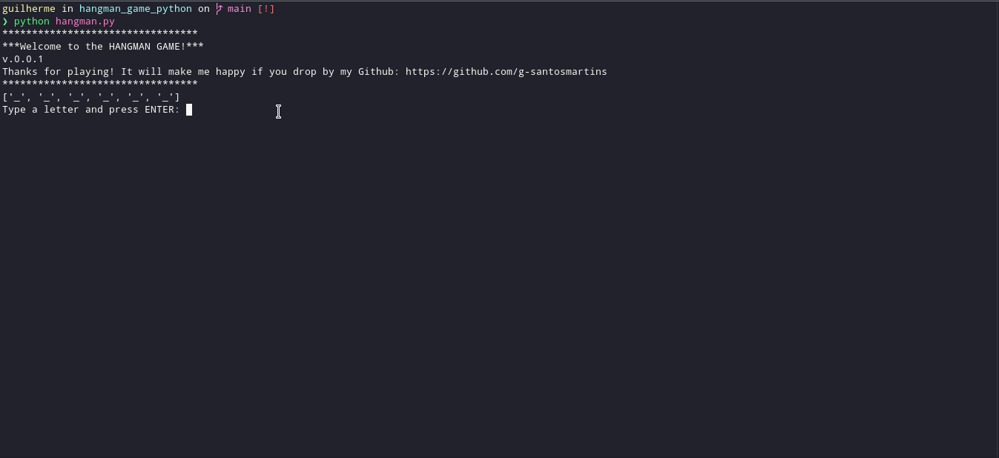

# :white_check_mark: Python Hangman Game 

I made this game as result of my first Python course at [Alura](https://www.alura.com.br/), I made some refactoring to make it better, if you have any issue or opinion, please let me know!

## :rocket: Project preview: 

  

## :round_pushpin: First of all make sure you have python installed:

Open your terminal and run 

`python --version`

if it returns nothing about, you can find python here: 

[Download - Python](https://www.python.org/downloads/)

## :round_pushpin: ​You can basically import the file and have some fun:
You also can use **python c**

`from hangman import play`

to add this module in your personal project.

Then call it as a function:

`play()`

## :round_pushpin: ​Running direct on your terminal 

`git clone https://github.com/g-santosmartins/hangman_game_python.git `

`cd hangman_game_python`

and then run:

`python hangman.py`

Way to go! Have fun!
